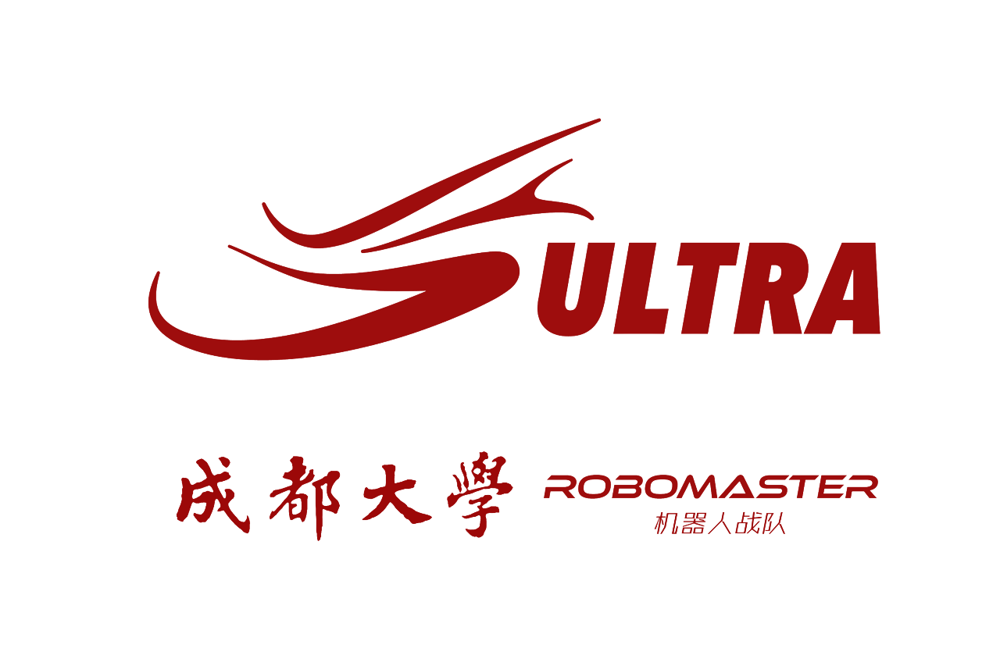
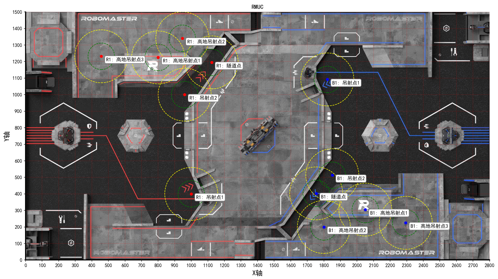
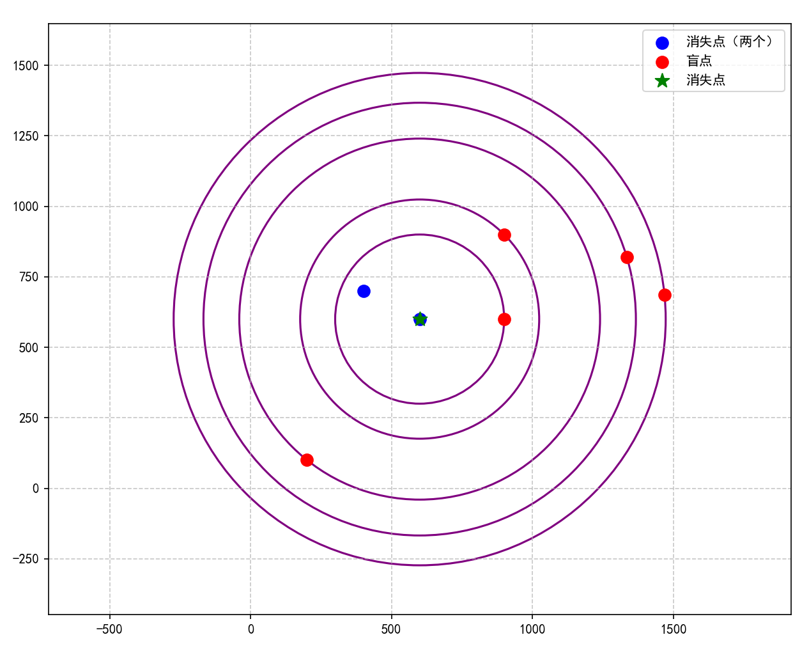
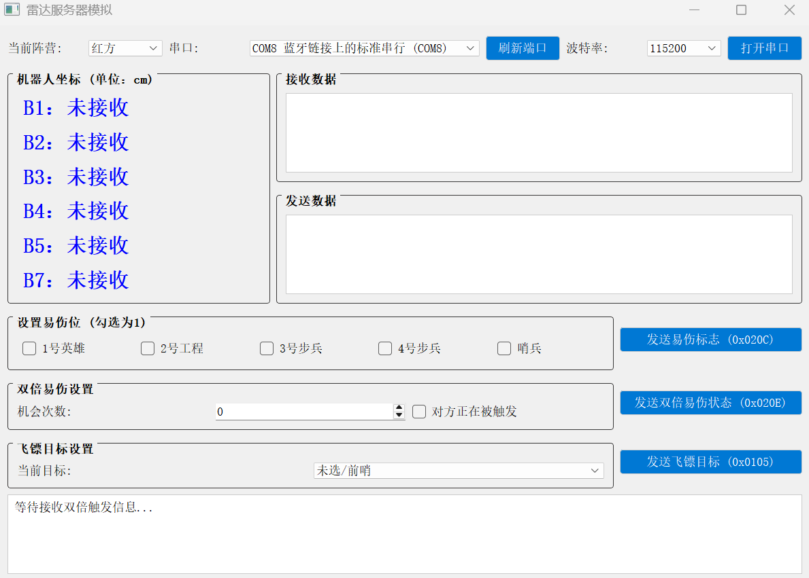
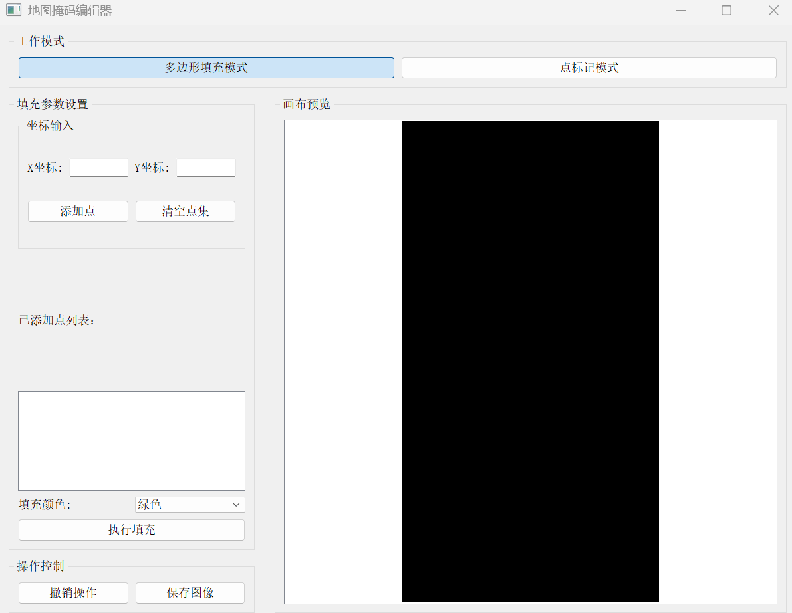
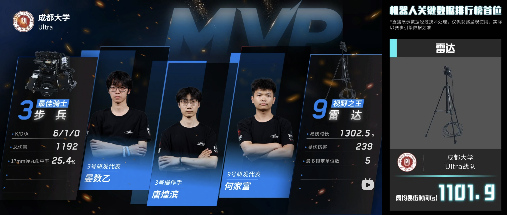

<h1 align="center">
  <a href="http://rmultra.cn"></a>
  <br/>
  <a href="http://rmultra.cn">成都大学 Ultra 战队 2025 赛季单目雷达站开源</a>
</h1>

---

## 📖 概述

本项目基于[厦门理工学院PFA战队单目雷达站](https://github.com/CarryzhangZKY/pfa_vision_radar)开源项目进行优化开发，
针对2025赛季规则进行适配升级

## ✨ 功能

与厦理开源一样的地方就不过多赘述，只介绍一下项目修改的地方

1. 添加并适配 2025 赛季**新地图**
2. 修改**串口通信**数据处理逻辑，以适配新协议
3. 利用**PyQt5**开发测试程序，`PNG_draw.py` 和 `QT_串口助手.py`，方便测试，排查隐患
4. 用户参数在 `main.py` 开头
5. 增加**视频录制**功能
6. 增加**盲点优先级排序**，动态预测
7. 增加**地图可视化**

## 🚀 使用

[数据集](https://github.com/NGC2237plus/Ultra-Radar-Dataset-2025)

**开发环境**：

Windows 11 24H2 + i5-12500H + 16.0 GB + RTX3050(4GB) + CUDA12.1

依赖可以看 `requirements.txt` 文件，`tensorrt` 最好用 `8.6.1` 版本

### 1. 参数设置（main.py）

```python
state = 'R'  # R:红方，B:蓝方
USART = 1  # 0:关闭串口，1:打开串口
user_com = 'COM8'  # 串口号
user_mode = 'test'  # 'test':测试模式,'hik':海康相机,'video':USB相机
user_map = 'images/2025map.png'  # 战场地图，2800*1500，左下角坐标原点
user_img_test = 'images/test_image.jpg'  # 测试图片，支持视频，user_mode为test才生效
user_ExposureTime = 20000  # 海康相机曝光 
user_Gain = 16  # 海康相机gain

save_img = 0  # 0:关闭视频录制，1:开启视频录制
game_dir = "tete"  # 视频保存的根目录
# 视频保存
video_dir_map = "save_video/" + game_dir + "/map/"  # 地图录制保存路径
video_dir_raw = "save_video/" + game_dir + "/raw/"  # 原始相机画面保存路径
video_dir_ui = "save_video/" + game_dir + "/ui/"  # 添加yolo识别框后的画面保存路径
```

### 2. 盲点优先级排序：

```python
d_factor = 0.01  # 欧式距离指数系数
cos_factor = 0.003  # 余弦相似度系数
```

使用 `RMUL_axis.py` 确定盲点坐标，战术部署，绿色圈为 `准确`，黄色圈为 `半准确`

<div align="center">
  
</div>

然后把坐标填写到 `main.py` 144行的 `guess_table` 字典里，
或者填写到 `guess_plt.py` 的 `guess_table` 字典里，测试 `d_factor`，`cos_factor` 的值

填写 `guess_plt.py` 100行的 `l1` 列表，这个列表表示机器人消失后（进入盲区）最后识别的两个坐标，运行输出：

<div align="center">
  
</div>

```sh
排序前： [(200, 100), (900, 900), (900, 600), (1335, 821), (1469, 687)]
排序后： [(900, 600), (900, 900), (1469, 687), (1335, 821), (200, 100)]
```

原理：设目标消失前最后两个位置坐标为 $P_{t-1}=(x_1,y_1)$ 和 $P_{t}=(x_2,y_2)$ ，则速度向量：

$$
\vec{v}=(v_x,v_y)=(x_2-x_1,y_2-y_1)
$$

该向量表征目标瞬时运动方向，模长反映运动速度

对于候选固定点 $F_{i}=(f_x,f_y)$，构建预测向量：

$$
\vec{d_i}=(d_x,d_y)=(f_x-x_2,f_y-y_2)
$$

通过余弦相似度度量:

$$
Similarity = \cos \theta = \frac{\vec{v} \vec{d_i}}{\lVert \vec{v} \rVert \lVert \vec{d_i} \rVert}
$$

距离采用指数衰减

$$
D_{i}=e^{-\beta \lVert \vec{d_i} \rVert}
$$

综合评分为加权和：

$$
score=\alpha · Similarity + (1-\alpha) · D_{i}
$$

分数越高，优先级越高，排序越靠前，先遍历到的概率就越高，就越可能先锁定到机器人

`d_factor`，`cos_factor` 参数值确定后就可以添加到 `main.py` 52行

### 3. QT_串口助手.py

<div align="center">
  
</div>

与电控使用的串口助手类似，模拟裁判系统通信

可以显示接受的坐标信息，发送和雷达相关数据进行测试，运行代码后选择红蓝方，串口号和波特率，打开串口即可

> [!warning]
>
> 串口号不能和 `main.py` 的相同

### 4. PNG_draw.py

<div align="center">
  
</div>

主要用于测试，绘制测试图，然后给标定时使用

## 📂 项目结构

```text
├── main.py                 # 主程序入口
├── RMUL_axis.py            # 坐标标定工具
├── QT_串口助手.py           # 串口测试工具
├── PNG_draw.py             # 地图生成工具
├── guess_plt.py            # 盲点优先级测试
├── images/                 # 资源文件
├── save_video/             # 录像存储目录
└── requirements.txt        # 依赖
```

## 📈 成果

- 局均易伤时间**1101.9s**，位列中部第一
- 基本每局都能识别3个以上的机器人，比较稳定
- 双倍触发稳定发挥

<div align="center">
  
</div>

## 💡 经验

1. 机械切割的板材可以再增加一个把手，方便拿取
2. 雷达站的高度3m以上，准备了5m的线，线太长了不方便收纳，建议用卷线盘，方便收纳，上场时也省出理线的时间
3. 雷达站的准确度过度依赖标定，所以还要提高标定的准确度
4. 标定流程时间紧张，而且今年高地的43度坡没有几个机器人能上去，所以第3层的标定可以忽略（乱标就行），节省时间
5. 盲点预测还可以按基地距离来排序
6. 人员最好两个人，一个在下面连线，如HDMI，USB，TTL串口，必须懂得RX/TX的连接。另一个在上面，通过下面连接的屏幕鼠标键盘，进行标定和代码运行
7. 线材规格要高，如USB3.0
8. 心态要稳，标定不能手抖
9. 多观察对方喜欢待的盲点点位，下一场比赛可以提前把坐标加上去
10. 多和其他队伍交流，不要闭门造车，总结别人的经验
11. 雷达站今年是第一次研发，成绩不错，但作为辅助，在地面机器人没有做强时，不需要做过多修改
12. 为测试而开发的QT软件很好，多用多测试，尽早发现问题，多模拟正式比赛流程，提前熟悉

## 🩹 不足

1. 远距离的识别率低
2. 依赖飞镖来触发双倍，但如果前哨站没有摧毁，飞镖无法切换目标，就无法触发双倍
3. 机械上，三脚架不是很稳定，而且官方雷达站平台会震动，搭建的并不稳定，有可能很让摄像头移位
4. 我方区域存在非常大的盲区，盲点预测也无法完美解决

## 🚧 开发流程记录

**2025.4.7-2025.4.13**：

- 完成新地图的修改
- 根据高度重新绘制了3层掩码图，黑色为地面，绿色为200mm高度，蓝色为600mm高度
- 对串口协议接收的数据进行处理，上赛季雷达站识别到机器人后发送坐标，裁判系统马上就会反馈数据，而本赛季只有进度大于100后才会返回数据1，
  所以当接收到数据时，乘以100，如flag=0，则value=0，flag=1，则value=100。这样就能适配新协议了
- 开头增加用户设置参数，把需要设置的参数集中到代码前几行，不需要四处找了，快速修改
- bug：新协议没有5号机器人，处理数据时要在列表里插入

**2025.4.14-2025.4.18**：

- 机械完成了三脚架的安装，摄像头的固定，裁判系统的板材切割和安装

**2025.4.20-2025.4.30**：

- 雷达站整体已经开发完成，开始进行测试，排查漏洞
- 战场地图大小为28m*15m，这么大的场地很难找，通过分析代码yolo识别原理，以及仿射变换，其实不一定需要这么大的场地
    - 先找一个大小合适的场地，如5m*5m
    - 在地上摆放4个标志物，用于标定，并测量坐标
    - 标定完后运行代码，把识别的坐标和实际测量的坐标进行对比
    - 为了方便测试，提前练习赛场标定流程，编写了 `PNG_draw.py`，方便生成测试地图
- 为了方便测试，开发 `QT_串口助手.py`，模拟与裁判端的通信，包括易伤标志， 双倍易伤次数，坐标等设置选项，
  根据新的串口协议和雷达站进行通信，快速排查问题
- 源代码只有哨兵的盲点预测和发送，对其进行修改，支持所有地面机器人的盲点预测和发送
- 源代码盲点只能设置两个坐标点，修改下标的循环判断为盲点列表长度取余，这样盲点列表的坐标点数量不再受限制
- bug：当机器人处于高度层分界点时，小概率判断不了机器人的位于的高度层，所以在高度层全部判断完后，加else直接使用中间层，误差会小很多
- 串口助手增加红蓝方选择，QT页面也好看好用一点
- 优化 `PNG_draw.py`，可以用于生成测试地图和绘制掩码地图
- 优化标定的QT窗口大小，让窗口尽可能填满屏幕，提高标定的准确度
- 串口助手增加飞镖目标设置，用于触发双倍易伤
- bug：串口助手增加飞镖目标后才发现的，飞镖目标的串口数据协议也修改了，所以处理数据也要修改，右移6位获取目标值（源代码是右移5位）

**2025.5.1-正式比赛**：

- 增加视频录制功能，因为缺少可以使用的数据集，为了测试能够更加贴合正式比赛，增加视频录制，方便复盘和后续开发
- 增加盲点列表优先级排序，根据距离大小和余弦相似度判断每个盲点坐标的优先级，根据优先级降序排序，这样能更快锁定到位于盲点的机器人
- 增加地图可视化，用plt把盲点和地图绘制出来，能够快速查看盲点坐标，提前进行战术部署

## 🙏 致谢

特别感谢 **厦门理工学院PFA战队** 开源的[单目视觉雷达站](https://github.com/CarryzhangZKY/pfa_vision_radar)

特别感谢 **成都信息工程大学风信子战队** 在南部区域赛中分享的宝贵实战经验

---

🧑‍💻 开发团队：成都大学 Ultra 战队算法组

📧 联系方式：QQ3093236313
